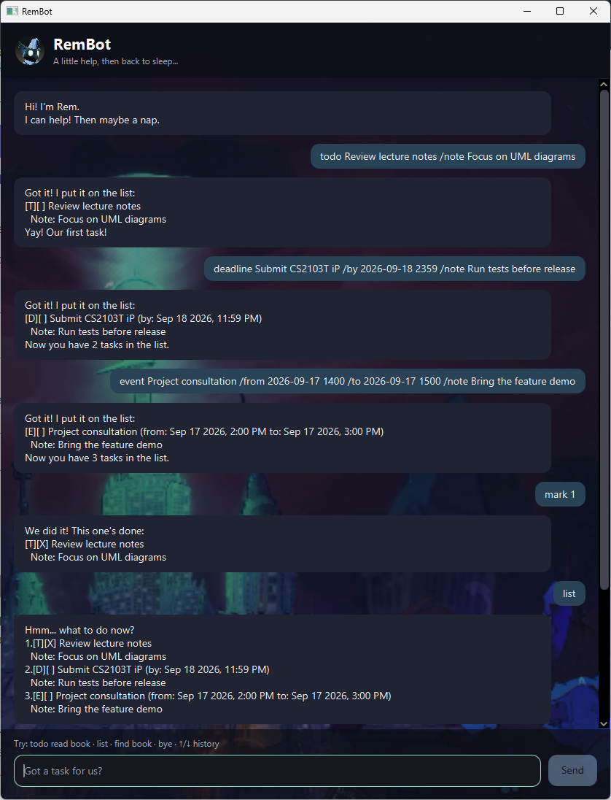

# RemBot User Guide

RemBot is a task-tracking chatbot product for people who prefer typing short commands to navigating
menus. Its assistant, Rem, can keep todos, deadlines, events, and notes between sessions.



*Figure 1. RemBot's graphical interface. The Rem profile image is sourced from
[Deadlock Wiki — Rem](https://deadlock.wiki/Rem). The chat background is sourced from
[this Instagram Reel](https://www.instagram.com/reel/DV0S49FiML4/).*

## Quick start

1. Install Java 25.
2. Download `rembot.jar` from the
   [latest RemBot release](https://github.com/dygrik/ip/releases).
3. Put the JAR file in a folder where RemBot can keep its saved data.
4. Open a terminal in that folder and run:

   ```text
   java -jar rembot.jar
   ```

Type a command in the box at the bottom of the window, then press Enter or select **Send**. Use the
Up and Down arrow keys to move through commands entered during the current session. If a command is
invalid, Rem keeps it in the box so you can correct it.

## Command summary

| Action | Command |
|---|---|
| Add a todo | `todo DESCRIPTION` |
| Add a deadline | `deadline DESCRIPTION /by DATE [TIME]` |
| Add an event | `event DESCRIPTION /from DATE [TIME] /to DATE [TIME]` |
| Show every task | `list` |
| Search descriptions and notes | `find KEYWORD` |
| Show tasks scheduled on a date | `on DATE` |
| Mark a task as done | `mark TASK_NUMBER` |
| Mark a task as not done | `unmark TASK_NUMBER` |
| Delete a task | `delete TASK_NUMBER` |
| Add or replace a note | `note TASK_NUMBER NOTE` |
| Remove a note | `deletenote TASK_NUMBER` |
| Exit RemBot | `bye` |

Words in `UPPER_CASE` are values you supply. Items in `[square brackets]` are optional. Do not type
the brackets.

## Adding tasks

### Adding a todo: `todo`

Use a todo for a task without a scheduled date.

Format:

```text
todo DESCRIPTION
```

Example:

```text
todo Review lecture notes
```

### Adding a deadline: `deadline`

Use a deadline for a task that must be completed by a particular date or time.

Format:

```text
deadline DESCRIPTION /by DATE [TIME]
```

Examples:

```text
deadline Submit CS2103T iP /by 2026-09-18 2359
deadline Return library book /by 20/9/2026
```

### Adding an event: `event`

Use an event for an activity with a start and an end. The end must be later than the start.

Format:

```text
event DESCRIPTION /from DATE [TIME] /to DATE [TIME]
```

Example:

```text
event Project consultation /from 2026-09-17 1400 /to 2026-09-17 1500
```

### Adding a note while creating a task

Add `/note NOTE` at the end of any task-creation command:

```text
todo Review lecture notes /note Focus on UML diagrams
deadline Submit CS2103T iP /by 2026-09-18 2359 /note Run tests before release
event Project consultation /from 2026-09-17 1400 /to 2026-09-17 1500 /note Bring the feature demo
```

Everything after `/note` becomes the note, including text such as `/by` or `/to`. A note must be a
single line containing 1 to 200 characters.

## Viewing tasks

### Showing every task: `list`

Enter `list` without any arguments:

```text
list
```

Rem numbers the tasks from `1`. Use these numbers with commands such as `mark`, `note`, and
`delete`.

The symbols beside each task have the following meanings:

- `[T]`: todo
- `[D]`: deadline
- `[E]`: event
- `[X]`: completed
- `[ ]`: not completed

### Finding tasks by text: `find`

`find` searches both descriptions and notes. Matching is not case-sensitive.

Format:

```text
find KEYWORD
```

Example:

```text
find UML
```

### Finding tasks on a date: `on`

`on` shows deadlines due on a date and events that overlap that date. Todos are not included.

Format:

```text
on DATE
```

Example:

```text
on 2026-09-17
```

The numbers shown by `find` and `on` belong only to those filtered results. Run `list` before using
a task number with `mark`, `unmark`, `delete`, `note`, or `deletenote`.

## Updating tasks

### Marking a task as done: `mark`

```text
mark TASK_NUMBER
```

Example:

```text
mark 1
```

### Marking a task as not done: `unmark`

```text
unmark TASK_NUMBER
```

Example:

```text
unmark 1
```

### Adding or replacing a note: `note`

Each task can have one note. If the task already has one, `note` replaces it.

Format:

```text
note TASK_NUMBER NOTE
```

Example:

```text
note 2 Include screenshots in the submission
```

### Removing a note: `deletenote`

```text
deletenote TASK_NUMBER
```

Example:

```text
deletenote 2
```

### Deleting a task: `delete`

```text
delete TASK_NUMBER
```

Example:

```text
delete 3
```

The remaining tasks are renumbered after a deletion. Run `list` again before making another change.

## Date and time formats

RemBot accepts either of these date formats:

- `YYYY-MM-DD`, for example `2026-09-18`
- `D/M/YYYY`, for example `18/9/2026`

Add an optional four-digit, 24-hour time after the date:

```text
2026-09-18 0930
2026-09-18 2359
```

A date without a time means midnight. Use explicit times when an event starts and ends on the same
day.

## Saving and exiting

RemBot saves changes automatically to `data/rem.txt`, relative to the folder from which it was
launched. To close RemBot, enter:

```text
bye
```

The farewell remains visible briefly before the window closes.

If `data/rem.txt` does not exist, RemBot starts with an empty task list. If its contents are malformed,
RemBot offers to start fresh or exit. Choosing **Start Fresh** keeps the damaged data beside the
original file as a timestamped backup such as `rem-corrupt-20260917-143025.txt`, then creates a new
empty `rem.txt`. RemBot never replaces the malformed file without confirmation.

If the file cannot be accessed because of its path or permissions, RemBot reports the problem and
blocks further saves to protect the existing data. Repair the path or permissions, then restart
RemBot; the start-fresh option is not shown for these access problems.

## Input rules

- Commands and fields such as `/note` are not case-sensitive.
- Extra spaces and tabs between command parts are accepted.
- Descriptions and notes must stay on one line.
- `list` and `bye` do not accept arguments.
- A deadline needs exactly one `/by` field.
- An event needs one `/from` field followed by one `/to` field.
- Duplicate tasks with the same type, description, schedule, and note are rejected.
- Quoted descriptions and escape sequences are not supported.

When RemBot rejects a command, read the error message for the expected format and an example. The
invalid command remains in the input box so you can edit and submit it again.
